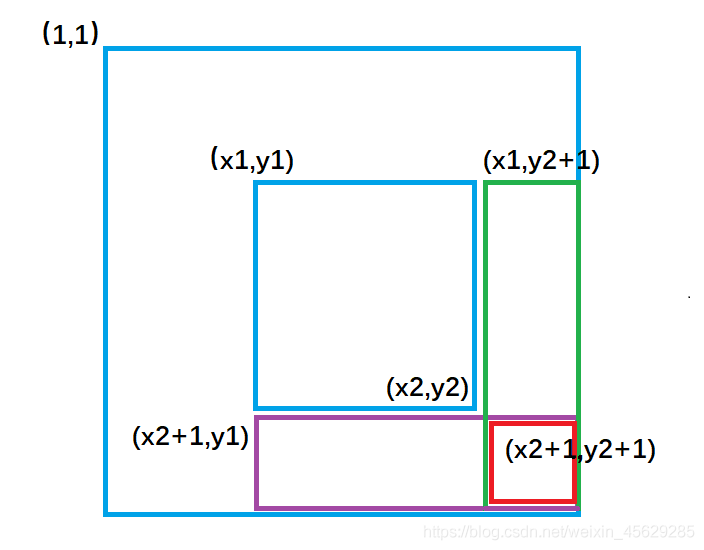
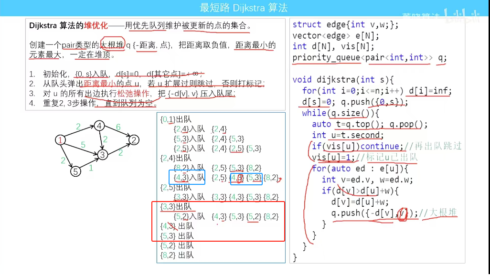
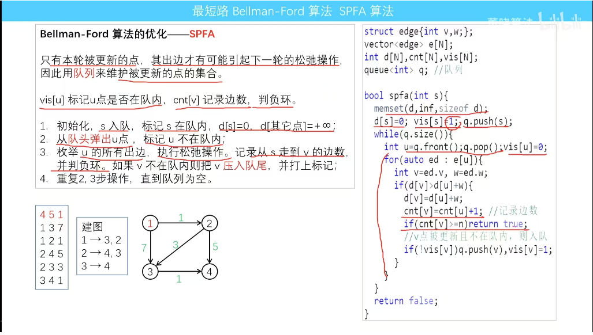

##  算法基础 

### 排序 

#### 冒泡排序
```C++
void bubble_sort(int arr[], int n) 
{
    for(int i = 1; i < n; i ++) // n - 1轮，每轮确定一个最优
    {
        bool is_over = true; // 判断是否已经提前排完

        /*
            j = 0 ~ n - i - 1
        */
        for(int j = 0; j < n - i; j ++)
        {
            if(arr[j] > arr[j + 1]) sort(arr[j], arr[j + 1]);
            is_over = false;
        }
        if(is_over) break;
    }
}
```

#### 插入排序 O(n^2) // 待商榷
为将待排列元素划分为「已排序」和「未排序」两部分，每次从「未排序的」元素中选择一个插入到「已排序的」元素中的正确位置。  
每次都需要找到应该插入的位置 ,初始时默认a[0],一个数已经排好序  
使用双指针实现，i从1遍历a，j每次归为到i - 1
比较a[i] , a[j]
```C++
void insertion_sort(int arr[], int len) 
{
    for (int i = 1; i < len; ++i) 
    {
        int key = arr[i];
        int j = i - 1;
        while (j >= 0 && arr[j] > key) 
        {
            arr[j + 1] = arr[j]; // 将 arr[j] 后移，覆盖掉arr[j+1]
            j--;
        }
       arr[j + 1] = key; // 此时j == -1 || arr[j] <= key,插到j+1
    }
}
```
* 二分优化
  使用二分查找插入位置，对插入排序时间复杂度中的常数进行了优化，所以优化后的时间复杂度仍然不变。  
```C++
void insertion_sort(int arr[], int len)
{
    if (len < 2) return;
    for (int i = 1; i <> len; ++ i) 
    {
      int key = arr[i];
      auto index = upper_bound(arr, arr + i, key) - arr;
      // 使用 memmove 移动元素，比使用 for 循环速度更快，时间复杂度仍为 O(n)
      memmove(arr + index + 1, arr + index, (i - index) * sizeof(int));
      arr[index] = key;
    }
}
```

#### 计数排序 O(n + w),w为最大数
1. 计算每个数出现了几次；  cnt[N]
2. 求出每个数出现次数的 前缀和；  
3. 利用出现次数的前缀和，从右至左计算每个数的排名。

```C++
int n, w, a[N], cnt[W], b[N];

void counting_sort() 
{
  memset(cnt, 0, sizeof(cnt));
  for (int i = 1; i <= n; ++i) ++cnt[a[i]];
  for (int i = 1; i <= w; ++i) cnt[i] += cnt[i - 1]; 
  for (int i = n; i >= 1; --i) b[cnt[a[i]]--] = a[i];// a[i]前应留cnt[a[i]]个空位
}
```

#### 基数排序 (我不理解,未完待续)


#### 快速排序 (优化与拓展未完待续)
1. 分:大于x的在一边,小于x的在一边
2. 递归  
***注意：***
x的取值:
    当给定的序列有序时，如果每次选择区间左端点进行划分，
    每次会将区间[L, R]划分成[L, L]和[L + 1, R]，那么相当于
    每次递归右半部分的区间长度只会减少1,所以就需要递归 n-1次了,
    时间复杂度会达到 n^2。但每次选择区间中点或者随机值时
    ，划分的两个子区间长度会比较均匀，那么期望只会递归 logn

```C++
void quick_sort(int q[],int l,int r)
{
    if(l>=r)    return ;//左右指针相遇，跳出
    int i=l-1,j=r+1;//左右指针，向外扩充一位，因为是移动
    int x=q[l+r>>1];//取中间值好一点，不然可能超时
    
    while(i<j)
    {
        do i++;while(q[i]<x);
        do j--;while(q[j]>x);
        if(i<j)// sort(q[i],q[j]);
        {
            int t=q[i];
            q[i]=q[j];
            q[j]=t;
        }
    }
    quick_sort(q,l,j),quick_sort(q,j+1,r);
}
```


#### 归并排序
```C++
void merge_sort(int q[],int l,int r)
{
    if(l>=r) return;
    int mid=l+r>>1;//确定分界点
    merge_sort(q,l,mid),merge_sort(q,mid+1,r);//递归排序
    int k=0,i=l,j=mid+1;//两个指针
    while(i<=mid&&j<=r)//归并排序
    {
        if(q[i]<=q[j]) tmp[k++]=q[i++];
        else tmp[k++]=q[j++];
    }
    //处理剩下的
    while(i<=mid) tmp[k++]=q[i++];
    while(j<=r) tmp[k++]=q[j++];
    //复制到原数组,此时i，j是新的变量，新的含义
    for(i=l,j=0;i<=r;i++,j++) q[i]=tmp[j];
}
```


### 前缀和 & 差分

#### 前缀和
1. 一维前缀和
```C++
S[i] = S[i - 1] + a[i];
a[l] + ... + a[r] = S[r] - S[l - 1]; // l ~ r 之和
```

2. 二维前缀和 
```C++
//第i行j列格子左上部分所有元素的和
s[i][j]=s[i-1][j]+s[i][j-1]-s[i-1][j-1]+s[i][j];

//(x1, y1)---左上角，(x2, y2)---右下角的子矩阵的和为：
S[x2, y2] - S[x1 - 1, y2] - S[x2, y1 - 1] + S[x1 - 1, y1 - 1];
``` 

3. 多维前缀和（不理解，待续）
  3.1 逐维前缀和
  特例： 子集和 DP

4. 树上前缀和 (待续)

#### 差分
前缀和的逆  
已知a[N],b[N]为a[N]的差分，a[N]为b[N]的前缀和  
想将一个数组a[N]的一个区间的数都加上c：   
* 更新b[N];
* 在求b[N]前缀和 
1. 一维差分
给区间[l, r]中的每个数加上c：
```c++
void insert(int l, int r, int c)
{
    b[l] += c; // 使 l 及之后的数都加上 c
    b[r + 1] -= c; // 使 r + 1 及之后的数都加上 c
}
```
初始化可以 l == r 

2. 二维差分
给以(x1, y1)为左上角，(x2, y2)为右下角的子矩阵中的所有元素加上c：

```C++
void insert(int x1, int y1, int x2, int y2, int c)
{
    b[x1][y1] += c;         // （x1，y1）及右下角都加上 c
    b[x2 + 1][y1] -= c;     // 多加的部分减掉
    b[x1][y2 + 1] -= c;     // 多加的部分减掉
    b[x2 + 1][y2 + 1] += c; //（x2，y2）及右下角都补加上 c(加了一次，减了两次)
}
```
初始化可以 l == r   


3. 树上差分(待续)

### 二分
查找满足条件的最值，不只局限与查找有序数字的target  
1. I----√----***I*** I----------I  满足条件的最后一个
2. I----------I ***I***----√----I  第一个满足条件的

```c++
// 情况一：
// 区间[l, r]被划分成[l, mid - 1]和[mid, r]时使用：
int bsearch_1(int l, int r)
{
    while (l < r)
    {
        int mid = l + r + 1 >> 1;
        if (check(mid)) l = mid;    // target 在 l 及 l 之后
        else r = mid - 1;           // target 一定在 r 之前
    }
    return l;
}
```
```c++
// 情况二：
// 区间[l, r]被划分成[l, mid]和[mid + 1, r]时使用：
int bsearch_2(int l, int r)
{
    while (l < r)
    {
        int mid = l + r >> 1;
        if (check(mid)) r = mid;     // target 在 r 及 r 之前
        else l = mid + 1;            // target 一定在 r 之后
    }   
    return l;
}
```
**分析：**  
1. l = mid, r = mid 不能同时存在；   
当只有两个元素时，r = l + 1：  
若 **mid = l + r >> 1**  
l = mid, mid = l + r >> 1 = l + l + 1 >> 1 = l;  ***l陷入循环***  
若 **mid = l + r >> 1**  
r = mid, mid = l + r + 1 >> 1 = 2l + 2 >> 1 = l + 1;  ***r陷入循环***  

2. 出现 r = mid - 1(情况1)，通过向上取整(l + r + 1 >> 1),防止 l 陷入循环
3. 出现 l = mid + 1(情况2)，通过向下取整(l + r >> 1),防止 r 陷入循环  
  

**STL:**  
1.头文件
#include <algorithm>
2.使用方法
* binary_search：查找有序区间某个元素是否出现,返回 bool  
```c++
binary_search(arr[], arr[]+size, indx)
    /*
        arr[]： 数组首地址
        size：数组元素个数
        indx:需要查找的值
    */
```
* lower_bound: 第一个不小于该值的位置。如果所有元素都小于，则返回last的位置
* upper_bound：找到一个值在有序区间内的第一个大于该值的位置，返回的是相等元素范围的结束位置
示例：
```c++
    int a[100]= {4,10,11,30,69,70,96,100};
    int b=binary_search(a,a+9,4);//查找成功，返回1
    cout<<"在数组中查找元素4，结果为："<<b<<endl;
    int c=binary_search(a,a+9,40);//查找失败，返回0
    cout<<"在数组中查找元素40，结果为："<<c<<endl;
    int d=lower_bound(a,a+9,10)-a;
    cout<<"在数组中查找第一个大于等于10的元素位置，结果为："<<d<<endl;
    int e=lower_bound(a,a+9,101)-a;
    cout<<"在数组中查找第一个大于等于101的元素位置，结果为："<<e<<endl;
    int f=upper_bound(a,a+9,10)-a;
    cout<<"在数组中查找第一个大于10的元素位置，结果为："<<f<<endl;
    int g=upper_bound(a,a+9,101)-a;
    cout<<"在数组中查找第一个大于101的元素位置，结果为："<<g<<endl;
```

C++ 标准库中实现了查找首个不小于给定值的元素的函数 std::lower_bound 和查找首个大于给定值的元素的函数 std::upper_bound，二者均定义于头文件 <algorithm> 中。

二者均采用二分实现，所以调用前必须保证元素有序


## 搜索
#### dfs
#### bfs

## 图论
### 图的存储
1. 直接存边
    ```c++
    struct Edge {
    int u, v;
    // int e; // 如果带权
    };
    ```
**复杂度**  
查询是否存在某条边：O(m)  
遍历一个点的所有出边：O(m)  
遍历整张图：O(nm)  
空间复杂度：O(m)   
**应用**  
在 Kruskal 算法 中，由于需要将边按边权排序，需要直接存边。  
在有的题目中，需要多次建图（如建一遍原图，建一遍反图），此时既可以使用多个其它数据结构来同时存储多张图，也可以将边直接存下来，需要重新建图时利用直接存下的边来建图。

2. 邻接矩阵
    ```c++
    bool g[a][b];   // a -> b 
    int  g[a][b];   // a -> b 带权,不存在可设为∞.或视题意设为-1  
    ```

**复杂度**
查询是否存在某条边：O(1)  
遍历一个点的所有出边：O(n)  
遍历整张图：O(n^2)  
空间复杂度：O(n^2)  

**应用**
一般在稠密图（）上使用，而不再稀疏图中用(浪费空间)  

3. 邻接表  
```c++
// 对于每个点k，开一个单链表，存储k所有可以走到的点。h[k]存储这个单链表的头结点
int h[N], e[N], ne[N], idx;

// 添加一条边a->b
void add(int a, int b)
{
    e[idx] = b, ne[idx] = h[a], h[a] = idx ++ ;
}

// 初始化
idx = 0;
memset(h, -1, sizeof h);
```

**复杂度**
查询是否存在 u 到 v 的边：O(d+(u))  
遍历点 u 的所有出边：O(d+(u))  
遍历整张图：O(n+m)  
空间复杂度：O(m)    

### 图的遍历
**时间复杂度**：O(n + m)
1. DFS 
```c++
int dfs(int u)
{
    st[u] = true; // st[u] 表示点u已经被遍历过

    for (int i = h[u]; i != -1; i = ne[i])
    {
        int j = e[i];
        if (!st[j]) dfs(j);
    }
}
```
2. BFS
```c++
queue<int> q;
st[1] = true; // 表示1号点已经被遍历过
q.push(1);

while (q.size())
{
    int t = q.front();
    q.pop();

    for (int i = h[t]; i != -1; i = ne[i])
    {
        int j = e[i];
        if (!st[j])
        {
            st[j] = true; // 表示点j已经被遍历过
            q.push(j);
        }
    }
}
```

### 拓扑排序
有向无环图(***DAG***, *Directed Acyclic Graph*)一定存在拓扑排序  
能 **拓扑排序** 的图，一定是有向无环图  

1.构建，初始化入度（链式前向星添加入度）  
2.寻找入度为 0 的点，放入队列中  
3.弹出队头，访问该点的邻点，并把邻点入度减 1，若邻点入读变为 0，则把该点放入队列中  
4.若最后队列中有 n 个点，则存在拓扑序

**时间复杂度 O(n+m)，n 为点数，m 为边数**  
```c++
int h[N],ne[N],e[N],idx; 
int indu[N];
int q[N];       // 模拟队列

// 添加入度
void add(int u,int v)
{
    e[idx] = v,ne[idx] = h[u],h[u] = idx ++;
    indu[v] ++;
}

// 判断是否为拓扑排序，同时队列记录一条拓扑序
bool topsort()
{
    int hh = 0, tt = -1;

    // indo[i] 存储点i的入度
    for (int i = 1; i <= n; i ++ )
        if (!indo[i])
            q[ ++ tt] = i;

    while (hh <= tt)
    {
        int t = q[hh ++ ];      // 取出队头入度为零的元素

        for (int i = h[t]; i != -1; i = ne[i]) 
        {
            int j = e[i];
            indo[h] --;         // 删去邻接边
            if (indo[j] == 0)   // 如果邻点钟新出现了入度为零的点
                q[ ++ tt] = j;
        }
    }

    // 如果所有点都入队了，说明存在拓扑序列；否则不存在拓扑序列
    // 同时队列从 0 ~ n - 1 存储了一条拓扑序列
    return tt == n - 1;
}
```


### 最短路

#### Floyd
全源  
时间复杂度是 O(n^3)
```c++
初始化：
    for (int i = 1; i <= n; i ++ )
        for (int j = 1; j <= n; j ++ )
            if (i == j) d[i][j] = 0;
            else d[i][j] = INF;

// 算法结束后，d[a][b]表示a到b的最短距离
void floyd()
{
    for (int k = 1; k <= n; k ++ )
        for (int i = 1; i <= n; i ++ )
            for (int j = 1; j <= n; j ++ )
                d[i][j] = min(d[i][j], d[i][k] + d[k][j]);
}
```

#### dijkstra
求解 **非负权图** 上单源最短路径  
**步骤**
* 将结点分成两个集合：已确定最短路长度的点集（记为 S 集合）的和未确定最短路长度的点集（记为 T 集合）。一开始所有的点都属于 T 集合  
* 初始化 dis(s) = 0，其他点的 dis 均为 无穷大。
* 然后重复这些操作： 
    * 从 T 集合中，选取一个最短路长度最小的结点，移到 S 集合中
    * 对那些刚刚被加入 S 集合的结点的所有出边执行松弛操作
    * 直到 T 集合为空，算法结束  
**注意朴素版不一定比堆优化版慢，要视图而定**


1. 朴素版
时间复杂度:O(n^2 + m)，适合用在稠密图  
**步骤**  
1.dist 置成正无穷，令第一个点的距离为 0  
2.遍历未找到最短路径的所有点，找一条最短的路，加入已确定最短路径集合  
3.更新邻点到当前点的最短（松弛操作）  

```c++
int g[N][N];  // 存储每条边
int dist[N];  // 存储1号点到每个点的最短距离
bool st[N];   // 存储每个点的最短路是否已经确定

// 注意初始化
memset(g,0x3f,sizeof g);
memset(dis,0x3f,sizeof dist);

// 求1号点到n号点的最短路，如果不存在则返回-1
int dijkstra()
{
    dist[1] = 0;    // 起点初始化

    for (int i = 0; i < n - 1; i ++ )   // 每一轮确定一个点的最短路，还要确定n - 1 个
    {
        int t = -1;     // 在还未确定最短路的点中，寻找距离最小的点
        for (int j = 1; j <= n; j ++ )
            if (!st[j] && (t == -1 || dist[t] > dist[j]))
                t = j;

        // 用t更新其他点的距离
        for (int j = 1; j <= n; j ++ )
            dist[j] = min(dist[j], dist[t] + g[t][j]);

        st[t] = true;   // 加入已确定集合
    }

    if (dist[n] == 0x3f3f3f3f) return -1;   // 不可达
    return dist[n];
}
```

2. 堆优化  
考虑到每次从 T 集合中找最小，使用堆优化  
1.使用优先队列(小根堆)
2.把 dist  置成正无穷，起点距离为 0 ，把起点放入堆中
3.每次用堆顶来更新距离
时间复杂度:O(mlogn)，用于稀疏图
```c++
typedef pair<int, int> PII;

int n;      // 点的数量
int h[N], w[N], e[N], ne[N], idx;       // 邻接表存储所有边
int dist[N];        // 存储所有点到1号点的距离
bool st[N];     // 存储每个点的最短距离是否已确定

// 求1号点到n号点的最短距离，如果不存在，则返回-1
int dijkstra()
{
    memset(dist, 0x3f, sizeof dist);
    dist[1] = 0;
    priority_queue<PII, vector<PII>, greater<PII>> heap;
    heap.push({0, 1});      // first存储距离，second存储节点编号,距离在前，堆自动方便排序

    while (heap.size())
    {
        auto t = heap.top();    // 取最短
        heap.pop();             // 到某个点出队时，它一定是最短的了，会被打上标记

        int ver = t.second, distance = t.first;

        // 同一个点的最短路被更新多次，某一个点可能会入队几次，最优的一次肯定在前面，后面的其实都不要，因此前面的先出队时，给他打上标记，就不在用后面的点了，减少冗余
        if (st[ver]) continue;
        st[ver] = true;         // 出队时打上标记

        for (int i = h[ver]; i != -1; i = ne[i])
        {
            int j = e[i];
            if (dist[j] > distance + w[i])
            {
                dist[j] = distance + w[i];
                heap.push({dist[j], j});
            }
        }
    }

    if (dist[n] == 0x3f3f3f3f) return -1;
    return dist[n];
}
```


#### Bellman-Ford
在最短路存在的情况下，由于一次松弛操作会使最短路的边数至少 +1，而最短路的边数最多为 n-1，因此整个算法最多执行 n-1 轮松弛操作  
时间复杂度:O(mn)
```c++
int n, m;       // n表示点数，m表示边数
int dist[N];        // dist[x]存储1到x的最短路距离

struct Edge     // 边，a表示出点，b表示入点，w表示边的权重
{
    int a, b, w;
}edges[M];

// 求1到n的最短路距离，如果无法从1走到n，则返回-1。
int bellman_ford()
{
    memset(dist, 0x3f, sizeof dist);
    dist[1] = 0;

    // 如果第n次迭代仍然会松弛三角不等式，就说明存在一条长度是n+1的最短路径，由抽屉原理，路径中至少存在两个相同的点，说明图中存在负权回路。
    // 注意一定是负权回路，因为正权回路一定不会出现在最短路径中，也就不会松弛操作
    for (int i = 0; i < n; i ++ )
    {
        //flag = false; // 判断负环时，确定是否还松弛
        for (int j = 0; j < m; j ++ )
        {
            int a = edges[j].a, b = edges[j].b, w = edges[j].w;
            if (dist[b] > dist[a] + w)
                dist[b] = dist[a] + w;
        }
    }

    if (dist[n] > 0x3f3f3f3f / 2) return -1;
    return dist[n];
}
```

#### SPFA
实际是Bellman-Ford算法的优化，  
只有本轮被更新的点，其出边才有可能引起下一轮的松弛操作  
因此使用**队列**来维护被更新的点的集合   
  
**时间复杂度**:  平均情况下 O(m)，最坏情况下 O(nm)  
1.把 dist  置成正无穷，让起点距离为 0，把起点放进队列里  
2.循环整个队列，直到队列为空  
3.每次取出对头，把对头元素的访问状态变成 false  
4.遍历对头的邻点，进行松弛操作，如果邻点不在队列中，则将邻点放入 队列中  
```c++
int h[N], w[N], e[N], ne[N], idx;       // 邻接表存储所有边
int dist[N];        // 存储每个点到1号点的最短距离
bool st[N];     // 存储每个点是否在队列中

// 求1号点到n号点的最短路距离，如果从1号点无法走到n号点则返回-1
int spfa()
{
    memset(dist, 0x3f, sizeof dist);
    dist[1] = 0;

    queue<int> q;
    q.push(1);
    st[1] = true;

    while (q.size())
    {
        auto t = q.front();
        q.pop();

        st[t] = false;

        for (int i = h[t]; i != -1; i = ne[i])
        {
            int j = e[i];
            if (dist[j] > dist[t] + w[i])
            {
                dist[j] = dist[t] + w[i];
                if (!st[j])     // 如果队列中已存在j，则不需要将j重复插入
                {
                    q.push(j);
                    st[j] = true;
                }
            }
        }
    }

    if (dist[n] == 0x3f3f3f3f) return -1;
    return dist[n];
}
```
**应用：判断是否存在负环**
可以不用下面的，而是用：  

```c++
int dist[N], cnt[N];        // dist[x]存储1号点到x的最短距离，cnt[x]存储1到x的最短路中经过的点数
bool st[N];     // 存储每个点是否在队列中

// 如果存在负环，则返回true，否则返回false。
bool spfa()
{
    // 不需要初始化dist数组
    // 原理：如果某条最短路径上有n个点（除了自己），那么加上自己之后一共有n+1个点，由抽屉原理一定有两个点相同，所以存在环。

    queue<int> q;
    for (int i = 1; i <= n; i ++ )
    {
        q.push(i);
        st[i] = true;
    }

    while (q.size())
    {
        auto t = q.front();
        q.pop();

        st[t] = false;

        for (int i = h[t]; i != -1; i = ne[i])
        {
            int j = e[i];
            if (dist[j] > dist[t] + w[i])
            {
                dist[j] = dist[t] + w[i];
                cnt[j] = cnt[t] + 1;
                if (cnt[j] >= n) return true;       // 如果从1号点到x的最短路中包含至少n个点（不包括自己），则说明存在环
                if (!st[j])
                {
                    q.push(j);
                    st[j] = true;
                }
            }
        }
    }

    return false;
}
```

### 最小生成树 

#### prim 
1. 朴素版  
**时间复杂度是 O(n^2+m)** 
```c++
int g[N][N];        // 邻接矩阵，存储所有边
int dist[N];        // 存储其他点到当前最小生成树的距离
bool st[N];     // 存储每个点是否已经在生成树中

// 如果图不连通，则返回INF(值是0x3f3f3f3f), 否则返回最小生成树的树边权重之和
int prim()
{
    memset(dist, 0x3f, sizeof dist);

    int res = 0;
    for (int i = 0; i < n; i ++ )
    {
        // 每次选取不在树中，离树最近的点
        int t = -1;
        for (int j = 1; j <= n; j ++ )
            if (!st[j] && (t == -1 || dist[t] > dist[j]))
                t = j;
        // 第一次一定会找一个点
        if (i && dist[t] == INF) return INF;

        if (i) res += dist[t];
        st[t] = true;       // 加入树中

        
        // 更新距离
        for (int j = 1; j <= n; j ++ ) dist[j] = min(dist[j], g[t][j]);
    }

    return res;
}
```

#### Kruskal
时间复杂度: O(mlogn)，用于稀疏图  
1.按边权排序  
2.用并查集维护连通性，把不在集合中的点合并进来，形成一棵最小生成树  
```c++
int n, m;       // n是点数，m是边数
int p[N];       // 并查集的父节点数组

struct Edge     // 存储边
{
    int a, b, w;
    bool operator< (const Edge &W)const
    {
        return w < W.w;
    }
}edges[M];

int find(int x)     // 并查集核心操作
{
    if (p[x] != x) p[x] = find(p[x]);
    return p[x];
}

int kruskal()
{
    sort(edges, edges + m);

    for (int i = 1; i <= n; i ++ ) p[i] = i;    // 初始化并查集

    int res = 0, cnt = 0;
    for (int i = 0; i < m; i ++ )
    {
        int a = edges[i].a, b = edges[i].b, w = edges[i].w;

        a = find(a), b = find(b);
        if (a != b)     // 如果两个连通块不连通，则将这两个连通块合并
        {
            p[a] = b;
            res += w;
            cnt ++ ;
        }
    }

    if (cnt < n - 1) return INF;
    return res;
}
```


# 注
1. map
    ```c++
    // map 插入
    map.insert(make_pair(key,value));
    //或者
    map.insert(pair<char, int>(key, value))
    //或者
    map[key]=value
    ```